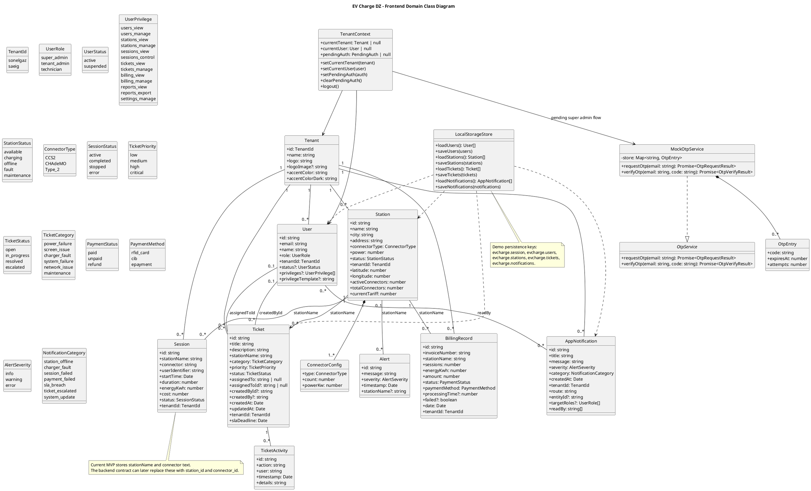
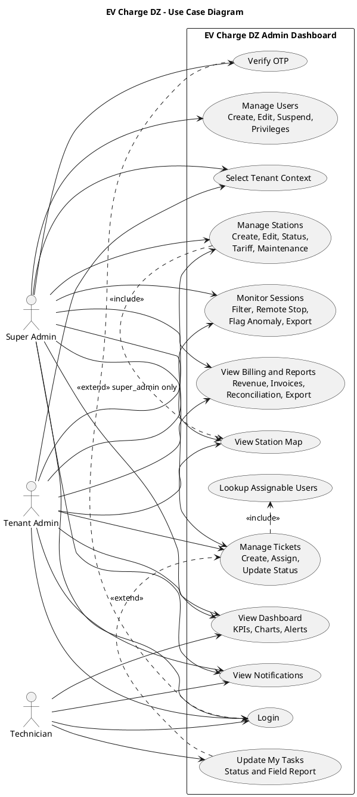
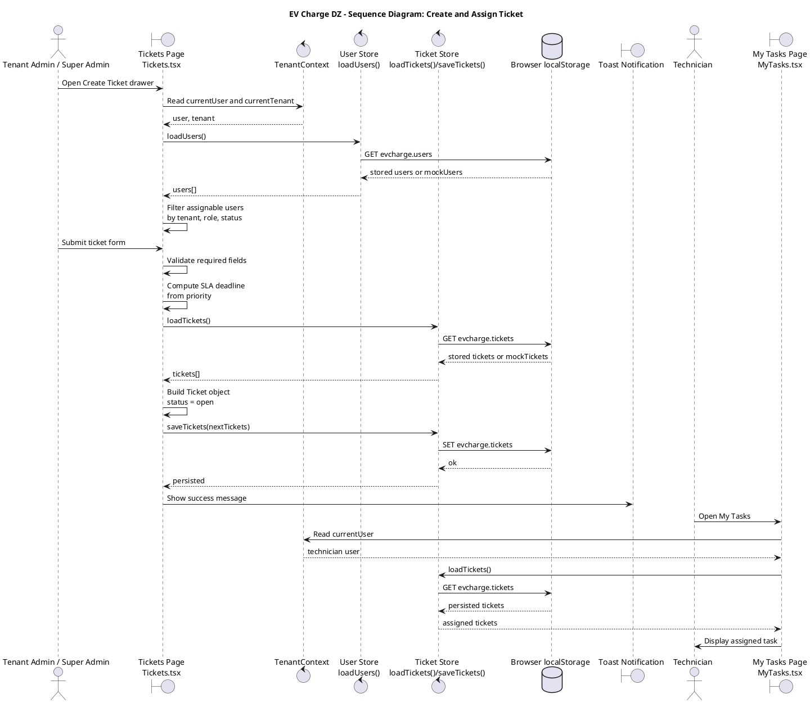
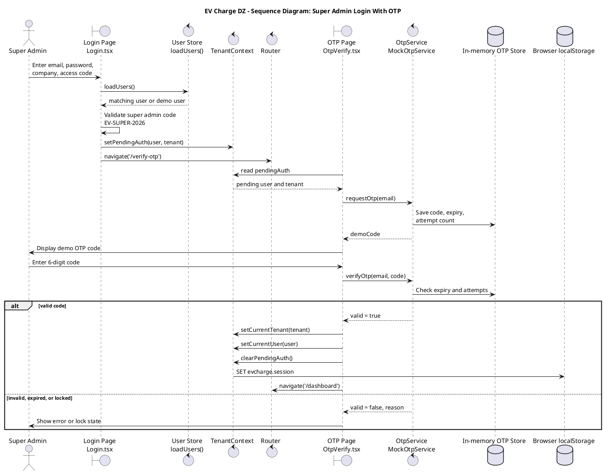
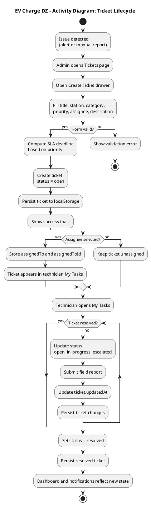
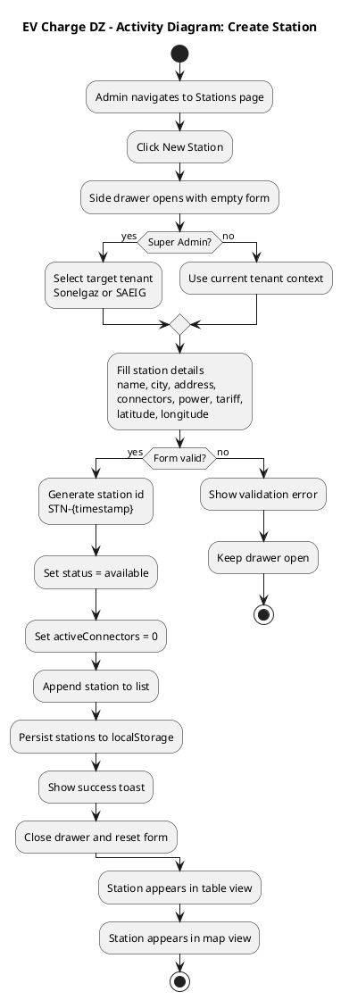
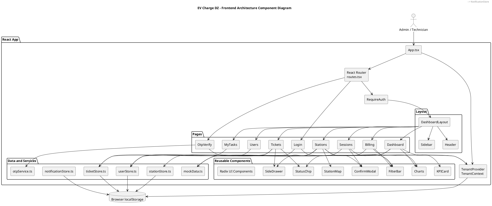

# EV Charge DZ - Editable UML Code

These diagrams are based on the current React/TypeScript project structure:

- Multi-tenant EV operations admin dashboard.
- Roles: `super_admin`, `tenant_admin`, `technician`.
- Main modules: Dashboard, Stations, Sessions, Tickets, Billing, Users, My Tasks.
- Demo persistence through `localStorage` stores for users, stations, tickets, notifications, and session context.
- Super Admin uses an extra OTP verification step.

## 1. Class Diagram

## 2. Use Case Diagram

## 3. Sequence Diagram - Create and Assign Ticket

## 4. Sequence Diagram - Super Admin Login With OTP

## 5. Activity Diagram - Ticket Lifecycle

## 6. Activity Diagram - Create Station

## 7. Component/Architecture Diagram

